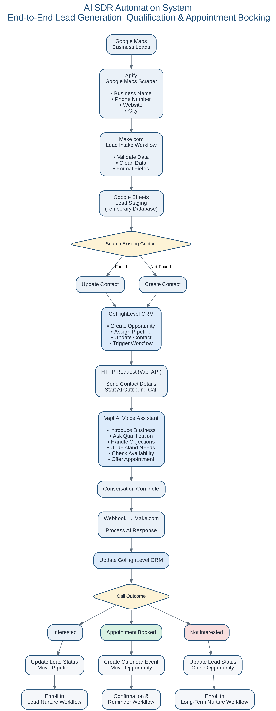

# AI SDR Automation System

> End-to-End AI Sales Development Representative (SDR) Automation built with Make.com, GoHighLevel, Vapi AI, OpenAI, APIs, and workflow automation.

---

## Overview

The **AI SDR Automation System** is an end-to-end sales automation platform designed to eliminate repetitive outbound sales tasks by automating lead generation, qualification, appointment booking, and CRM updates.

Instead of relying on sales representatives to manually search for prospects, make qualification calls, and schedule meetings, this solution leverages AI and low-code automation to create a scalable outbound sales workflow.

This project demonstrates how modern AI tools and workflow orchestration can be combined to build a complete sales system without requiring a custom backend.

---

## Business Problem

Many small businesses struggle to scale outbound sales because their processes are heavily manual.

Common challenges include:

* Manual lead research
* Manual CRM data entry
* Time-consuming qualification calls
* Manual appointment scheduling
* Missed follow-ups
* Inconsistent sales tracking

These inefficiencies increase operational costs while reducing conversion rates.

---

## Solution

This project automates the complete outbound sales workflow:

* Scrapes business leads automatically
* Stores leads inside GoHighLevel
* Qualifies prospects using an AI voice assistant
* Books appointments automatically
* Updates CRM records in real time
* Supports future SMS follow-up automation

---

# Technology Stack

| Technology    | Purpose                                 |
| ------------- | --------------------------------------- |
| Apify         | Google Maps Lead Scraping               |
| Make.com      | Workflow Orchestration                  |
| Google Sheets | Lead Staging                            |
| GoHighLevel   | CRM & Pipeline                          |
| Vapi AI       | AI Voice Agent                          |
| OpenAI        | Prompt Engineering & Conversation Logic |
| Twilio        | Phone Numbers & SMS                     |
| HTTP APIs     | Platform Integrations                   |
| Webhooks      | Event Processing                        |

---

# System Architecture

---

# Workflow

## Phase 1 — Lead Generation

Business leads are collected from Google Maps using Apify.

Extracted data includes:

* Business Name
* Phone Number
* Website
* City

The workflow automatically pushes the data into Google Sheets before synchronising it with GoHighLevel.

---

## Phase 2 — CRM Processing

The automation:

* Searches for existing contacts
* Prevents duplicate records
* Creates new contacts
* Updates existing contacts
* Creates sales opportunities
* Assigns pipeline stages

---

## Phase 3 — AI Qualification

Once a lead is created, Vapi automatically places an outbound AI call.

The AI agent:

* Introduces the business
* Asks qualification questions
* Handles common objections
* Determines buying intent
* Offers available appointment slots

---

## Phase 4 — Appointment Booking

If qualified, the AI:

* Checks GoHighLevel calendar availability
* Books appointments automatically
* Updates CRM opportunities
* Sends booking confirmation

---

## Phase 5 — Outcome Processing

After every conversation, Vapi sends webhook data back into Make.com.

Possible outcomes include:

* Interested
* Appointment Booked
* Not Interested

Each outcome automatically updates the CRM and triggers the appropriate workflow.

---

## Planned Enhancements

Future improvements include:

* SMS follow-up automation
* Email nurturing campaigns
* Lead scoring
* Multi-language AI voice support
* Reporting dashboard
* Analytics
* Conversation summarisation

---

# Skills Demonstrated

* AI Workflow Automation
* Business Process Analysis
* Make.com Scenario Design
* API Integration
* Webhooks
* GoHighLevel CRM Architecture
* AI Voice Agents (Vapi)
* Prompt Engineering
* Calendar Automation
* Lead Qualification
* Sales Automation
* Data Synchronisation

---

# Key Outcomes

* Automated lead generation
* AI-powered qualification
* Automated appointment scheduling
* CRM synchronisation
* Reduced manual administrative work
* Scalable outbound sales process

---

# Author

**Maria Fe Blanca**

AI Automation & Systems Architect

Specialising in AI-powered workflow automation, CRM architecture, API integrations, and business process optimisation.
